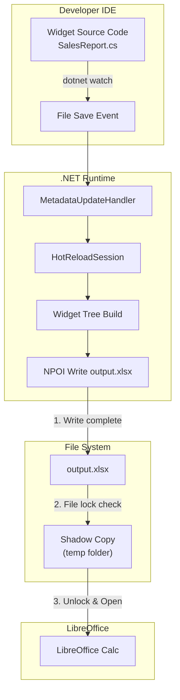

# NPOI Fluent API Declarative Hot Reload System

Building a declarative UI-style Excel development experience with live preview capabilities through .NET Hot Reload integration.

## User Review Required

> [!IMPORTANT]
> **New Project Required**: This feature requires creating a new `FluentNPOI.HotReload` project to keep the core library lightweight.

> [!WARNING]
> **LibreOffice Dependency**: The live preview feature requires LibreOffice Calc to be installed on the developer's machine for the intended workflow.

> [!CAUTION]
> **Hot Reload Limitations**: .NET Hot Reload has restrictions (no new fields in structs, limited lambda changes). System will auto-fallback to full restart mode when detecting "Rude Edits".

> [!TIP]
> **Leveraging Existing Style Cache**: This system integrates directly with FluentNPOI's existing style caching mechanism. This ensures that even during rapid hot reload cycles (e.g., 5-10 saves per minute), the generated .xlsx file remains compliant with Excel's 4,000 unique style limit by de-duplicating styles across the widget tree.

---

## Architecture Overview



---

## Proposed Changes

### FluentNPOI.HotReload (NEW Project) ✅ Phase 1 Complete

Create a new project to house all hot reload and widget infrastructure.

#### [DONE] FluentNPOI.HotReload.csproj

- Target: `net8.0`
- Dependencies: `FluentNPOI`, `Microsoft.VisualStudio.HotReload.Components`
- Package as optional NuGet extension

---

### Widget Engine Core ✅ Phase 1 Complete

#### [DONE] Widgets/ExcelWidget.cs

Base class for all declarative Excel widgets with source location tracking:

```csharp
public abstract class ExcelWidget
{
    public string? Key { get; set; }
    public DebugLocation SourceLocation { get; }
    
    // NEW: Flexbox-style layout support
    public int? Weight { get; set; }  // For auto column width calculation
    
    protected ExcelWidget(
        [CallerFilePath] string filePath = "",
        [CallerLineNumber] int lineNumber = 0)
    {
        SourceLocation = new DebugLocation(filePath, lineNumber);
    }
    
    public abstract void Build(ExcelContext ctx);
}
```

#### [DONE] Widgets/Column.cs, Row.cs, Header.cs, Label.cs, InputCell.cs

Core widget implementations following Flutter-style composition (20 unit tests passing).

#### [DONE] Context/ExcelContext.cs

Virtual sheet builder with position tracking.

---

### Enhanced Layout System (Phase 1.5 - NEW)

#### [NEW] Layout/FlexibleColumn.cs

Flexbox-inspired layout with automatic column width calculation:

```csharp
public class FlexibleColumn : ExcelWidget
{
    public List<ExcelWidget> Children { get; }
    public int DefaultWeight { get; set; } = 1;
    
    public override void Build(ExcelContext ctx)
    {
        // Calculate column widths based on Weight properties
        var totalWeight = Children.Sum(c => c.Weight ?? DefaultWeight);
        var availableWidth = 100; // Total width units
        
        foreach (var child in Children)
        {
            var weight = child.Weight ?? DefaultWeight;
            var colWidth = (int)(availableWidth * weight / totalWeight);
            ctx.SetColumnWidth(ctx.CurrentColumn, colWidth);
            child.Build(ctx);
            ctx.MoveToNextColumn();
        }
    }
}
```

#### [NEW] Styling/FluentStyle.cs

Fluent style builder with cache integration:

```csharp
public class FluentStyle
{
    public IndexedColors? FontColor { get; private set; }
    public IndexedColors? BackgroundColor { get; private set; }
    public bool IsBold { get; private set; }
    public BorderStyle? Border { get; private set; }
    
    public FluentStyle SetFontColor(IndexedColors color) { FontColor = color; return this; }
    public FluentStyle SetBackgroundColor(IndexedColors color) { BackgroundColor = color; return this; }
    public FluentStyle SetBold(bool bold = true) { IsBold = bold; return this; }
    public FluentStyle SetBorder(BorderStyle style) { Border = style; return this; }
    
    // Generates cache key for style deduplication
    internal string GetCacheKey() => $"{FontColor}|{BackgroundColor}|{IsBold}|{Border}";
}

// Usage
new Label("營收總計")
    .SetStyle(new FluentStyle()
        .SetFontColor(IndexedColors.Red)
        .SetBorder(BorderStyle.Thin)
        .SetBold())
```

---

### Hot Reload Infrastructure (Phase 2)

#### [NEW] HotReload/HotReloadSession.cs

Manages the hot reload lifecycle with Rude Edit fallback:

```csharp
public class HotReloadSession
{
    private readonly string _outputPath;
    private readonly Func<ExcelWidget> _rootWidgetFactory;
    private readonly StyleManager _styleManager = new();
    
    public void Start()
    {
        HotReloadHandler.RefreshRequested += OnRefreshRequested;
        HotReloadHandler.RudeEditDetected += OnRudeEditDetected;
        Refresh(); // Initial build
        LibreOfficeBridge.Open(_outputPath);
    }
    
    private void OnRefreshRequested(Type[]? updatedTypes)
    {
        Refresh();
    }
    
    private void OnRudeEditDetected()
    {
        // Auto-fallback to full restart mode
        Console.WriteLine("⚠️ Rude Edit detected, triggering full rebuild...");
        Environment.Exit(42); // Signal dotnet watch to restart
    }
    
    public void Refresh()
    {
        var widget = _rootWidgetFactory();
        var workbook = new FluentWorkbook(new XSSFWorkbook());
        
        // Reset style cache for new workbook instance
        _styleManager.Reset(workbook);
        
        var ctx = new ExcelContext(workbook.UseSheet("Sheet1", true), _styleManager);
        widget.Build(ctx);
        workbook.SaveToPath(_outputPath);
    }
}
```

#### [NEW] HotReload/HotReloadHandler.cs

MetadataUpdateHandler with Rude Edit detection:

```csharp
[assembly: MetadataUpdateHandler(typeof(HotReloadHandler))]

internal static class HotReloadHandler
{
    public static event Action<Type[]?>? RefreshRequested;
    public static event Action? RudeEditDetected;
    
    // Called by .NET runtime when hot reload occurs
    public static void UpdateApplication(Type[]? updatedTypes)
    {
        RefreshRequested?.Invoke(updatedTypes);
    }
    
    // Called when hot reload cannot apply changes
    public static void ClearCache(Type[]? updatedTypes)
    {
        RudeEditDetected?.Invoke();
    }
}
```

---

### LibreOffice Bridge (Phase 3)

#### [NEW] Bridge/LibreOfficeBridge.cs

Manages LibreOffice process lifecycle with file lock checking:

```csharp
public static class LibreOfficeBridge
{
    private static Process? _process;
    
    public static string? DetectPath()
    {
        var paths = new[]
        {
            @"C:\Program Files\LibreOffice\program\soffice.exe",
            @"C:\Program Files (x86)\LibreOffice\program\soffice.exe",
            "/usr/bin/libreoffice",
            "/Applications/LibreOffice.app/Contents/MacOS/soffice",
            Environment.GetEnvironmentVariable("LIBREOFFICE_PATH")
        };
        return paths.FirstOrDefault(p => p != null && File.Exists(p));
    }
    
    public static async Task OpenAsync(string filePath)
    {
        Kill();
        
        // Wait for NPOI to complete writing
        await WaitForFileLockRelease(filePath);
        
        var shadowPath = CreateShadowCopy(filePath);
        var sofficePath = DetectPath() ?? throw new Exception("LibreOffice not found");
        
        _process = Process.Start(new ProcessStartInfo
        {
            FileName = sofficePath,
            Arguments = $"--nologo --calc \"{shadowPath}\"",
            UseShellExecute = false
        });
    }
    
    // NEW: File lock checking before shadow copy
    private static async Task WaitForFileLockRelease(string filePath, int maxWaitMs = 3000)
    {
        var sw = Stopwatch.StartNew();
        while (sw.ElapsedMilliseconds < maxWaitMs)
        {
            try
            {
                using var fs = File.Open(filePath, FileMode.Open, FileAccess.Read, FileShare.None);
                return; // File is unlocked
            }
            catch (IOException)
            {
                await Task.Delay(50);
            }
        }
        throw new TimeoutException($"File {filePath} is still locked after {maxWaitMs}ms");
    }
    
    public static void Kill()
    {
        try
        {
            foreach (var proc in Process.GetProcessesByName("soffice.bin"))
                proc.Kill();
        }
        catch { /* Ignore process already exited */ }
    }
    
    private static string CreateShadowCopy(string original)
    {
        var shadow = Path.Combine(Path.GetTempPath(), 
            $"FluentNPOI_Preview_{Path.GetFileName(original)}");
        File.Copy(original, shadow, overwrite: true);
        return shadow;
    }
}
```

---

### Keyed State Management (Phase 4)

#### [NEW] State/KeyedStateManager.cs

Captures and restores user-modified values using CustomXMLParts (invisible storage):

```csharp
public class KeyedStateManager
{
    private readonly Dictionary<string, object?> _capturedValues = new();
    
    // Storage strategy options
    public StateStorageStrategy Strategy { get; set; } = StateStorageStrategy.CustomXmlParts;
    
    public void Capture(FluentWorkbook workbook)
    {
        switch (Strategy)
        {
            case StateStorageStrategy.CustomXmlParts:
                CaptureFromCustomXml(workbook);
                break;
            case StateStorageStrategy.HiddenSheet:
                CaptureFromHiddenSheet(workbook);
                break;
            case StateStorageStrategy.Comments:
                CaptureFromComments(workbook);
                break;
        }
    }
    
    private void CaptureFromCustomXml(FluentWorkbook workbook)
    {
        // Read state from CustomXMLParts (invisible to users)
        var xmlPart = workbook.GetCustomXmlPart("FluentNPOI.State");
        if (xmlPart != null)
        {
            var state = JsonSerializer.Deserialize<Dictionary<string, object?>>(xmlPart);
            foreach (var kvp in state)
                _capturedValues[kvp.Key] = kvp.Value;
        }
    }
    
    public void SaveState(FluentWorkbook workbook)
    {
        var json = JsonSerializer.Serialize(_capturedValues);
        workbook.SetCustomXmlPart("FluentNPOI.State", json);
    }
    
    public T? GetValue<T>(string key) => 
        _capturedValues.TryGetValue(key, out var val) ? (T?)val : default;
}

public enum StateStorageStrategy
{
    CustomXmlParts,  // Invisible, recommended
    HiddenSheet,     // For complex state
    Comments         // Visible but simple
}
```

---

### Diagnostics (Phase 1 Complete)

#### [DONE] Diagnostics/DebugLocation.cs

Source location tracking with reverse navigation support:

```csharp
public record DebugLocation(string FilePath, int LineNumber)
{
    public string ToComment() => $"Source: {Path.GetFileName(FilePath)}:{LineNumber}";
    
    // For VS Code Extension integration
    public string ToVSCodeLink() => $"vscode://file/{FilePath}:{LineNumber}";
    
    // For IDE-clickable link
    public string ToClickableLink() => $"file://{FilePath}#L{LineNumber}";
}
```

> [!NOTE]
> **Future Enhancement: Reverse Navigation**
> A VS Code Extension can parse Excel comments containing `Source: SalesReport.cs:45` and provide clickable links to jump directly to the source code line. This would be a powerful DX feature for the Antigravity project.

---

### Integration

#### [NEW] ExcelLivePreview.cs

High-level API for developers:

```csharp
public static class ExcelLivePreview
{
    public static void Run<TWidget>(string outputPath) where TWidget : ExcelWidget, new()
    {
        var session = new HotReloadSession(outputPath, () => new TWidget());
        session.Start();
        
        Console.WriteLine("🔥 Hot Reload active. Press Ctrl+C to exit.");
        Console.WriteLine($"📊 Preview: {outputPath}");
        
        // Keep app alive
        var cts = new CancellationTokenSource();
        Console.CancelKeyPress += (_, e) => { e.Cancel = true; cts.Cancel(); };
        
        try { Task.Delay(Timeout.Infinite, cts.Token).Wait(); }
        catch (OperationCanceledException) { }
        
        LibreOfficeBridge.Kill();
        Console.WriteLine("👋 Session ended.");
    }
}
```

---

## Verification Plan

### Automated Tests ✅ 20 Tests Passing

**1. Widget Rendering Tests**
```bash
dotnet test FluentNPOIUnitTest --filter "FullyQualifiedName~WidgetRendering"
```

**2. Context Tests**
```bash
dotnet test FluentNPOIUnitTest --filter "FullyQualifiedName~ExcelContext"
```

**3. LibreOffice Bridge Tests**
```bash
dotnet test FluentNPOIUnitTest --filter "FullyQualifiedName~LibreOfficeBridge"
```

### Manual Verification

1. Create example console app with `SalesReport : ExcelWidget`
2. Run with `dotnet watch run`
3. Modify style in code and save
4. Verify LibreOffice refreshes within 3 seconds

---

## Project Structure

```
FluentNPOI/
├── FluentNPOI/                    # Existing core library
├── FluentNPOI.HotReload/          # NEW: Hot reload extension
│   ├── FluentNPOI.HotReload.csproj
│   ├── Widgets/
│   │   ├── ExcelWidget.cs         ✅ Done
│   │   ├── Column.cs              ✅ Done
│   │   ├── Row.cs                 ✅ Done
│   │   ├── Header.cs              ✅ Done
│   │   ├── Label.cs               ✅ Done
│   │   ├── InputCell.cs           ✅ Done
│   │   └── FlexibleColumn.cs      📋 Phase 1.5
│   ├── Context/
│   │   └── ExcelContext.cs        ✅ Done
│   ├── Styling/
│   │   ├── FluentStyle.cs         📋 Phase 1.5
│   │   └── StyleManager.cs        📋 Phase 1.5
│   ├── HotReload/
│   │   ├── HotReloadHandler.cs    📋 Phase 2
│   │   └── HotReloadSession.cs    📋 Phase 2
│   ├── Bridge/
│   │   └── LibreOfficeBridge.cs   📋 Phase 3
│   ├── State/
│   │   └── KeyedStateManager.cs   📋 Phase 4
│   ├── Diagnostics/
│   │   └── DebugLocation.cs       ✅ Done
│   └── ExcelLivePreview.cs        📋 Phase 5
└── FluentNPOIUnitTest/
    └── WidgetRenderingTests.cs    ✅ Done (20 tests)
```

---

## API Preview

```csharp
// Program.cs
using FluentNPOI.HotReload;

ExcelLivePreview.Run<SalesReport>("output/preview.xlsx");

// SalesReport.cs
public class SalesReport : ExcelWidget
{
    public override void Build(ExcelContext ctx)
    {
        new Column(children: [
            new Header("年度銷售預算")
                .SetBackground(IndexedColors.RoyalBlue),
            
            // NEW: Flexbox-style auto width
            new FlexibleColumn([
                new Label("產品").WithWeight(2),
                new Label("價格").WithWeight(1),
                new Label("數量").WithWeight(1)
            ]),
            
            new Row(key: "input_area", cells: [
                new Label("調整係數"),
                new InputCell(defaultValue: 1.2)
            ])
        ]).Build(ctx);
    }
}
```

---

## Timeline Estimate

| Phase | Description | Status | Estimated Time |
|-------|-------------|--------|----------------|
| Phase 1 | Widget Engine Core | ✅ Complete | 4-6 hours |
| Phase 1.5 | Flexbox Layout & Styling | 📋 Planned | 2-3 hours |
| Phase 2 | Hot Reload Infrastructure | 📋 Planned | 3-4 hours |
| Phase 3 | LibreOffice Bridge | 📋 Planned | 2-3 hours |
| Phase 4 | Keyed State (CustomXML) | 📋 Planned | 3-4 hours |
| Phase 5 | Integration & Testing | 📋 Planned | 2-3 hours |
| **Total** | | | **16-23 hours** |

---

## Future Enhancements

### VS Code Extension: Reverse Navigation
- Parse Excel cell comments for `Source: *.cs:N` patterns
- Provide clickable links to jump to source code
- Integrate with VS Code's "Go to Definition" workflow

### Advanced State Persistence
- Support for complex UI state (collapsed sections, filters)
- Version migration for state schema changes
- Conflict resolution for multi-user editing

### Performance Optimizations
- Incremental widget tree diffing
- Partial sheet updates (only changed regions)
- Background thread file writing
